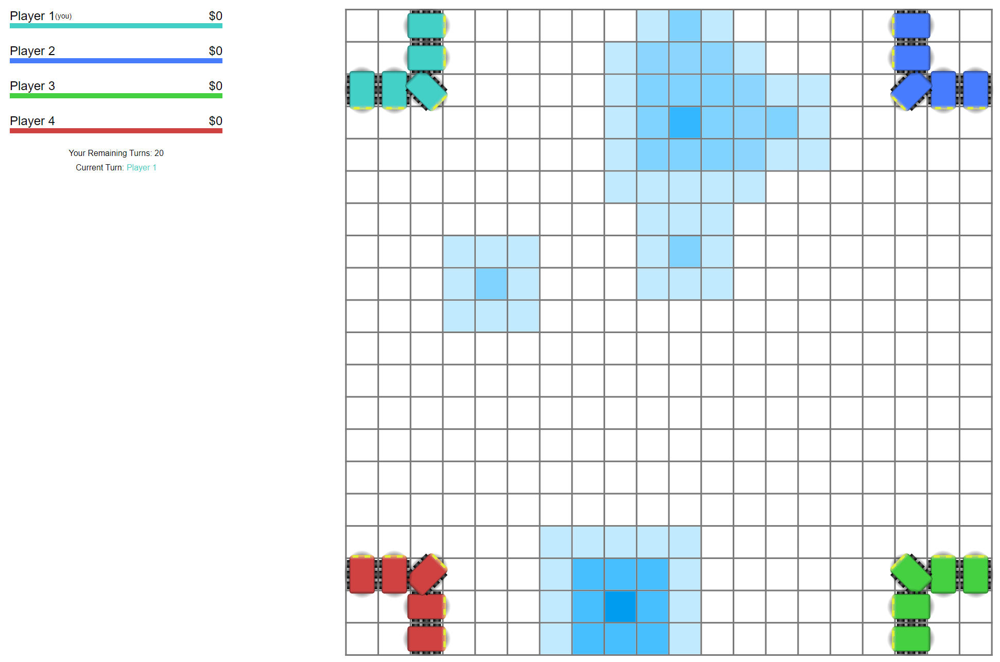

# Helium 3

A turn-based robot battle/resource game. WIP.

See the [docs](./docs) folder for more info about the game.



## Developing

```
$ npm i
$ npm run start:server

# In another terminal
$ npm start
```

## Creating Server

Requires Terraform and Ansible installed locally

1. Create `terraform/terraform.tfvars` with `linode_token` (from, you know,
   Linode). Include `private_key_path` and `public_key_path` if the defaults
   aren't correct.
2. ```
   $ terraform init
   $ terraform apply
   ```

## Deploying

1. Create `.env.deploy` with SERVER_IP, SERVER_USERNAME, and SERVER_DIRECTORY
2. `npm run deploy`
