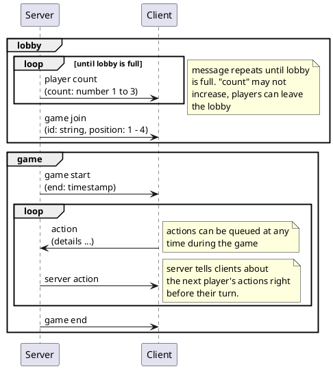

The Helium 3 client and server communicate with JSON over a web socket.

Messages contain as little information as possible -- the server and the client keep their state in sync using a shared state machine.

# Types

```ts
// Points must be on the board, which is 20x20, 0-indexed
type Point = { x: number; y: number };

type Direction = { vX: number; vY: number };

type RobotId = number;

type PlayerIndex = 0 | 1 | 2 | 3;

type Timestamp = number;

// Server actions include hidden state like enemy robots that were hit by a
// weapon but had a shield
type ServerAction =
  // `shield` indicates if the target had their shield armed
  | { type: "FIRE_MISSILE"; robot: RobotId; target: Point; shield: Bool }
  | { type: "ARM_MISSILE"; robot: RobotId; target: Point }
  // if the laser was stopped, that robot was shielded. all robots in the laser
  // path up to `stoppedBy` are destroyed
  | {
      type: "FIRE_LASER";
      robot: RobotId;
      target: Direction;
      stoppedBy: ?RobotId;
    }
  | { type: "ARM_LASER"; robot: RobotId; target: Point }
  // robots that are in range but not `destroyed` were shielded
  | { type: "KAMAKAZIE"; robot: RobotId; destroyed: RobotId[] }
  | { type: "MOVE"; robot: RobotId; target: Point }
  | { type: "MINE"; robot: RobotId; target: Point };

type ClientAction =
  | { action: "FIRE_MISSILE"; robot: RobotId; target: Point }
  | { action: "ARM_MISSILE"; robot: RobotId; target: Point }
  | { action: "FIRE_LASER"; robot: RobotId; target: number }
  | { action: "ARM_LASER"; robot: RobotId; target: Point }
  | { action: "SHIELD"; robot: RobotId; target: Point }
  | { action: "KAMAKAZIE"; robot: RobotId }
  | { action: "MOVE"; robot: RobotId; target: Point }
  | { action: "MINE"; robot: RobotId; target: Point };
```

# Lobby

When a client connects to the server, it is placed in the lobby. The server waits for four players to join the lobby, then starts a new game.

| Sender | Message                                                    |
| ------ | ---------------------------------------------------------- |
| Server | `{ type: 'player-count', count: 1 \| 2 \| 3 }`             |
| Server | `{ type: 'game-join', id: string, position: PlayerIndex }` |

# Game

While in a game:

- The server will broadcast events such as player turns or countdowns
- After the game starts, clients can queue actions. Actions may not be queued while a player is moving.
- Clients are automatically removed from the game after it ends

| Sender | Message                                                            | Notes                                                                                                           |
| ------ | ------------------------------------------------------------------ | --------------------------------------------------------------------------------------------------------------- |
| Server | `{ type: 'game-start', end: Timestamp }`                           |                                                                                                                 |
| Client | `{ type: 'queue', action: ClientAction }`                          |                                                                                                                 |
| Server | `{ type: 'action-countdown', player: PlayerIndex }`                | The indicated player will move after the countdown. Clients must wait for the `action` message for the actions. |
| Server | `{ type: 'action', player: PlayerIndex, actions: ServerAction[] }` | There may be 0, 1, or 2 moves.                                                                                  |

# Errors

The server will respond with `{ type: 'bad-message', reason: string }` for malformed or invalid messages. For example, a message with no `type` field, or `{ type: 'queue-action', robot: RobotId, action: 'SHIELD', target: { x: 10, y: -1 } }` (the target is not on the board).

Clients should carefully validate actions before sending, for example, a player cannot queue two of their robots to move to the same square. However, two different players may queue one of their robots to the same square. The player with the first turn gets to move, the later player's action is reset.

# Diagram


